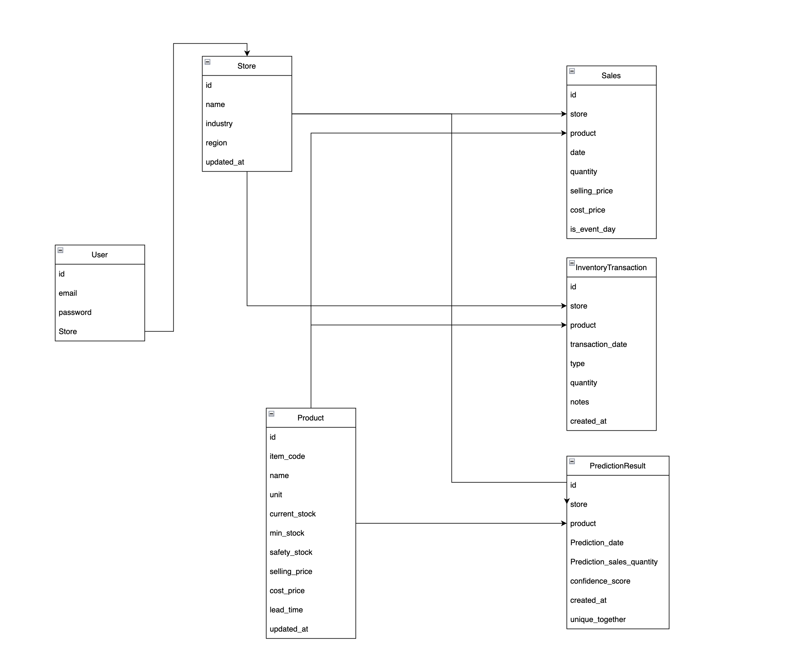

# PROPSTOCK : AI 기반 재고 관리 솔루션

프로젝트 시연 영상 : 

## 프로젝트 목적
"Propstock" 프로젝트는 소상공인이 효율적으로 재고를 관리하고 수요을 예측할 수 있도록 돕는 AI 기반 재고 관리 솔루션 입니다.

## 프로젝트 주요 기능
### 1. 판매 데이터 관리
- 일별 판매 수량을 수동 입력 기능
- 과거 판매 데이터 (.CSV, Excel) 일괄 업로드 기능
- 기간별, 품목별 판매 내역 조회, 수정 및 삭제 기능

### 2. 재고 관리
- 품목에 대한 마스터 데이터 등록 및 관리
- 입고, 폐기, 손실 등 판매 외 재고 변동 관리
- 실시간 재고 현황 및 상태 조회

### 3. 수요 예측 및 발주량 추천
- 과거 판매 데이터를 기반으로 한 AI 판매량 예측
- 예측된 수요와 현재 재고를 고려한 품목별 최적 발주량 및 시점 추천

### 4. 통계 및 리포트 
일별, 주간별, 월별 매출 및 판매량 추이 시각화

## 서비스 아키텍쳐

## 데이터베이스 스키마

**User** 
- Django의 `AbstractUser`를 상속받았으며, 유저의 정보를 나타냅니다.

**Store**
- 각 소상공인의 매장 정보를 나타내는 모델입니다.

**Product**
- 각 매장에서 판매하는 품목의 상세 정보를 나타내는 모델입니다.

**Sales**
- 매장에서 발생한 판매 기록을 저장하는 모델입니다.
- 해당 모델이 `Multipart/form-data`를 이용해 업로드 되며 추출되어 `Scikit-learn`의 학습 데이터로 가공됩니다.
  
**InventoryTransaction**
- 재고 변동 (입고 및 출고) 내역을 기록하는 모델입니다.

**PredictionResult**
- AI이 수요 예측 결과를 저장하는 모델입니다.

## 사용 기술 스택
**Frontend**
- React.js

**Backend**
- Django
- Django REST Framework

**AI Service**
- FastAPI
- Scikit-learn

**Database**
- PostgreSQL

**DevOps**
- Docker
- Docker Compose

## 소스 디렉토리 구조

## 팀원
문준호 : github.com/Door-juno

김도윤 : github.com/doyun-kim325

금문섭 : github.com/moonUSB